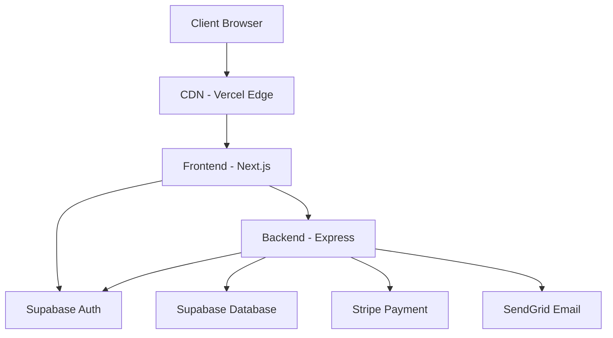

# System Architecture Overview

## System Design
The Monetary Catalyst is built as a modern, distributed system with clear separation of concerns between frontend and backend services. The architecture emphasizes security, scalability, and maintainability.

### High-Level Architecture

## Core Components

### Frontend (Next.js 14)
- **App Router Architecture**: Leverages Next.js 14's file-system based routing
- **Server Components**: Optimizes performance and SEO
- **Client-Side State**: React Context for global state management
- **TypeScript**: Ensures type safety across the application
- **Tailwind CSS**: Provides responsive, utility-first styling

### Backend (Express.js)
- **RESTful API**: Structured endpoints for all business operations
- **TypeScript**: Type-safe backend implementation
- **Middleware Pattern**: Authentication, validation, and error handling
- **Service Layer**: Abstracts business logic from controllers

### Data Layer
- **Supabase**: Primary database and authentication provider
- **Row Level Security**: Fine-grained access control
- **Real-time Subscriptions**: Live data updates
- **TypeScript Models**: Shared type definitions

## Key Interactions

### Authentication Flow
1. User initiates login/register
2. Frontend routes to Supabase Auth
3. Supabase returns JWT token
4. Token stored in secure HTTP-only cookie
5. Subsequent requests include token
6. Backend validates token with Supabase

### Payment Processing
1. User initiates subscription
2. Backend creates Stripe customer
3. Frontend loads Stripe Elements
4. User submits payment info
5. Stripe processes payment
6. Webhook notifies backend
7. Backend updates subscription status

### Content Delivery
1. User requests content
2. Next.js server component checks auth
3. Backend validates subscription
4. Content served based on access level
5. CDN caches permitted content

## Security Architecture

### Authentication Security
- JWT-based authentication
- Secure session management
- OAuth 2.0 integration
- CSRF protection
- Rate limiting

### Data Security
- Encrypted data in transit (TLS)
- Encrypted data at rest
- Row-level security policies
- Input validation
- Prepared statements

### API Security
- Request validation
- CORS policies
- Rate limiting
- API key rotation
- Webhook signature verification

## Performance Optimization

### Frontend Optimization
- Server components
- Static page generation
- Image optimization
- Code splitting
- Bundle optimization

### Backend Optimization
- Response caching
- Database indexing
- Query optimization
- Connection pooling
- Rate limiting

### CDN Strategy
- Edge caching
- Asset optimization
- Geographic distribution
- Cache invalidation
- Dynamic routing

## Monitoring and Observability

### Performance Monitoring
- API response times
- Database query performance
- Frontend load times
- Cache hit rates
- Error rates

### Business Metrics
- User engagement
- Subscription status
- Payment success rates
- Content access patterns
- Feature usage

## Scalability Considerations

### Horizontal Scaling
- Stateless backend services
- Distributed caching
- Load balancing
- Database replication
- Message queuing

### Vertical Scaling
- Database optimization
- Memory management
- CPU utilization
- Storage efficiency
- Connection pooling

## Development Workflow

### CI/CD Pipeline
- Automated testing
- Code quality checks
- Type checking
- Security scanning
- Automated deployment

### Environment Management
- Development
- Staging
- Production
- Feature branches
- Environment variables

## Future Considerations

### Technical Roadmap
1. Enhanced server component usage
2. GraphQL API implementation
3. Microservices architecture
4. Real-time analytics
5. A/B testing framework

### Scalability Plans
1. Geographic expansion
2. Multi-region deployment
3. Enhanced caching strategy
4. Performance optimization
5. Database sharding
