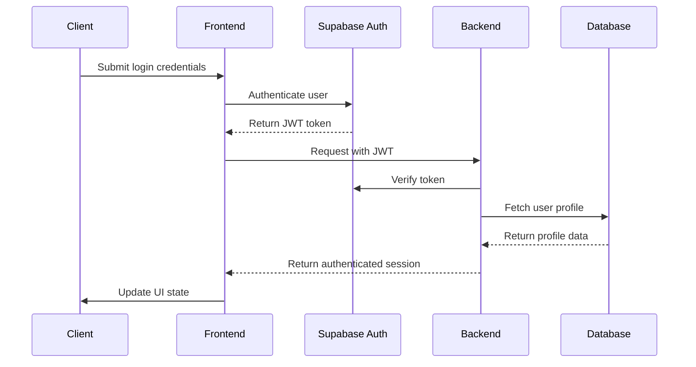
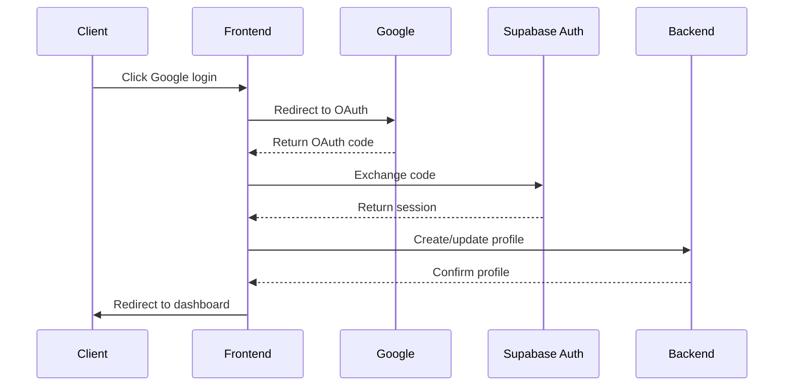
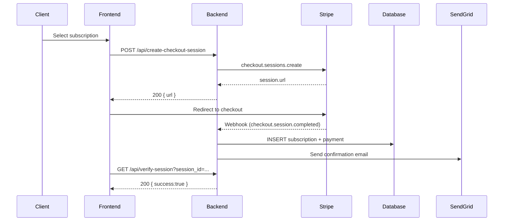
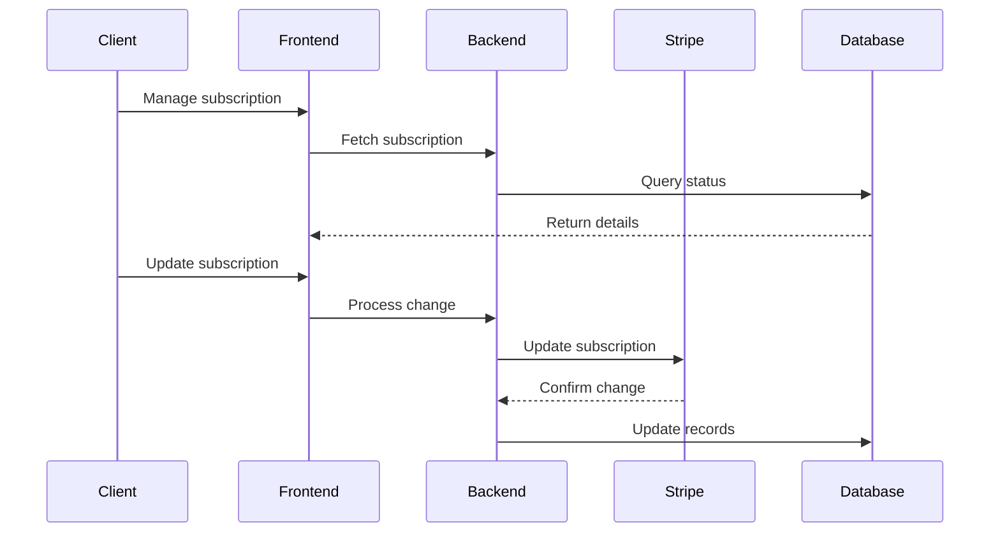
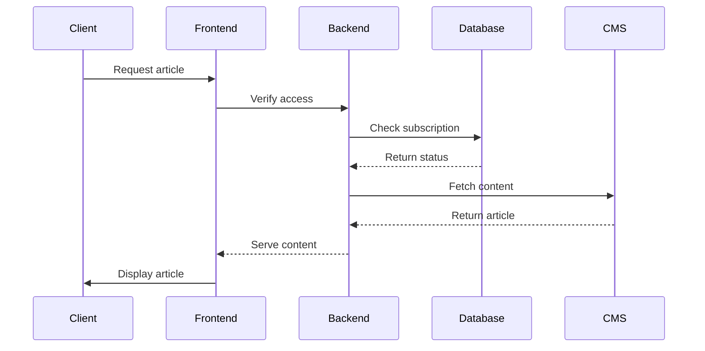
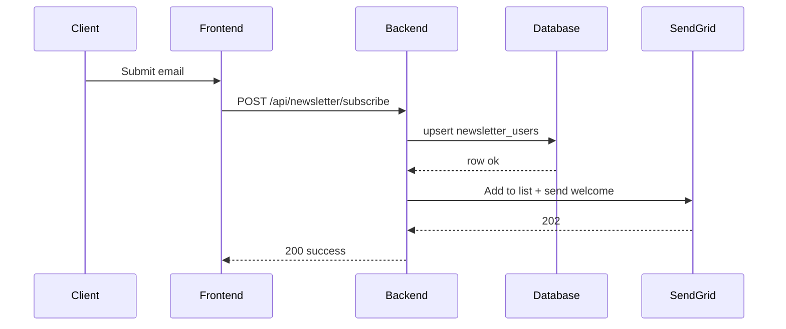
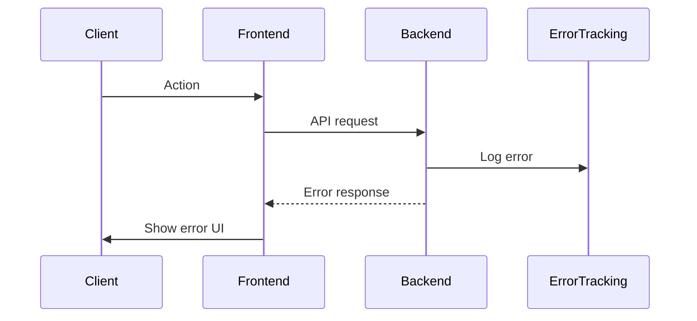
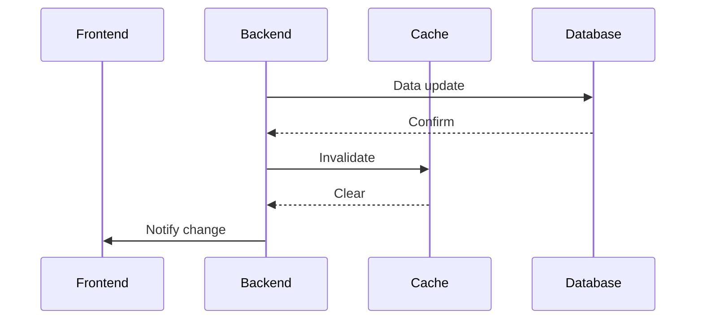

# Data Flow Documentation

## Overview
The Monetary Catalyst implements several key data flows between its frontend, backend, and integrated services (Supabase, Stripe, SendGrid). This document details these flows and their interactions.

## Authentication Flow

### Email/Password Authentication


### Google OAuth Flow


## Subscription Flow

### Payment Processing


### Subscription Management


## Content Access Flow

### Premium Content Access


### Content Gating
```typescript
interface ContentGateFlow {
  checkAccess: {
    input: {
      userId: string;
      contentId: string;
    };
    output: {
      hasAccess: boolean;
      subscriptionStatus: 'active' | 'inactive';
    };
  };
  serveContent: {
    input: {
      contentId: string;
      accessLevel: 'free' | 'premium';
    };
    output: {
      content: ArticleContent;
      metadata: ContentMetadata;
    };
  };
}
```

## Newsletter Flow

### Subscription Process


## Data Synchronization

### Database Updates
```typescript
interface DatabaseSync {
  tables: {
    user_profiles: {
      triggers: ['INSERT', 'UPDATE', 'DELETE'];
      realtime: boolean;
    };
    subscriptions: {
      triggers: ['UPDATE'];
      realtime: true;
    };
    newsletter_users: {
      triggers: ['INSERT', 'UPDATE'];
      realtime: false;
    };
  };
}
```

### Real-time Updates. Planned, not yet enabled in Production
```typescript
interface RealtimeFlow {
  subscriptionStatus: {
    channel: 'subscription_updates';
    events: ['status_change', 'payment_update'];
  };
  userProfile: {
    channel: 'profile_updates';
    events: ['profile_change', 'preferences_update'];
  };
}
```

## Error Handling Flow

### API Error Flow


### Error Recovery
```typescript
interface ErrorRecovery {
  retryStrategy: {
    maxAttempts: number;
    backoffMs: number;
    exponential: boolean;
  };
  fallbackBehavior: {
    cacheData: boolean;
    offlineMode: boolean;
    gracefulDegradation: boolean;
  };
}
```

## Caching Strategy

### Data Caching
```typescript
interface CacheFlow {
  levels: {
    browser: {
      storage: ['localStorage', 'sessionStorage'];
      duration: number;
    };
    cdn: {
      rules: CacheRules;
      invalidation: string[];
    };
    server: {
      type: 'memory' | 'redis';
      ttl: number;
    };
  };
}
```

### Cache Invalidation

