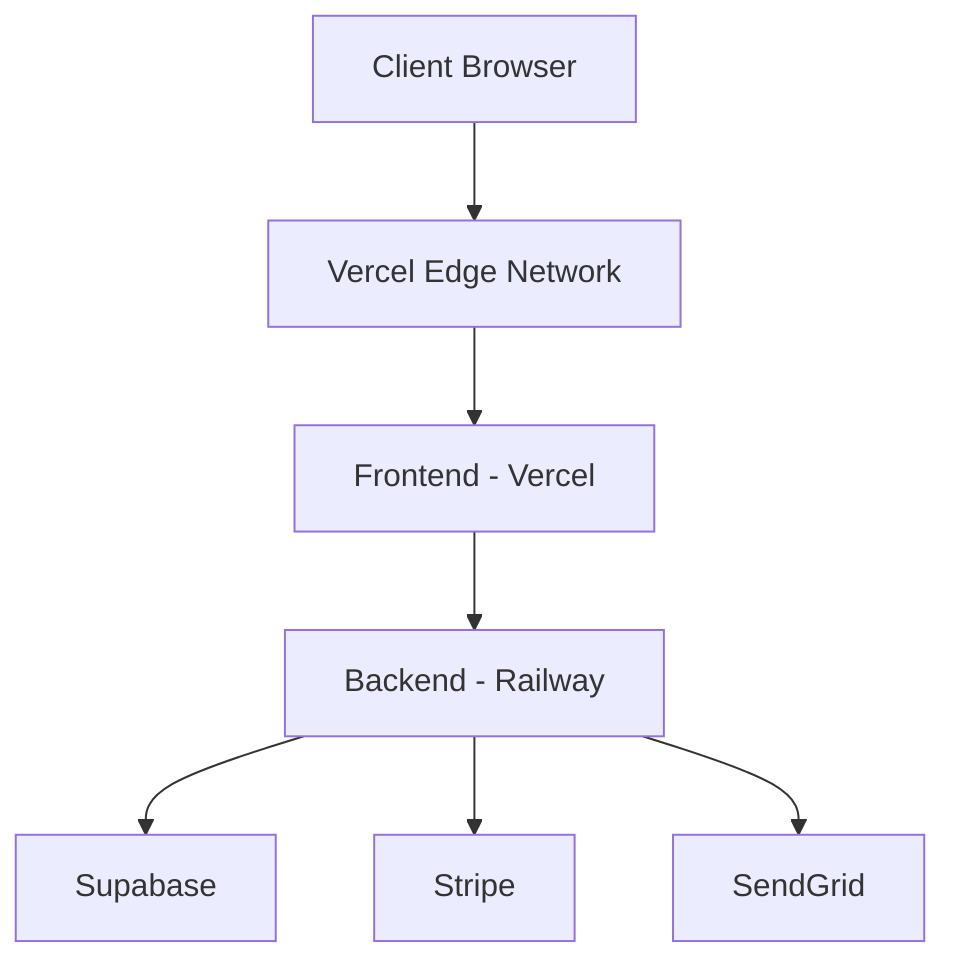

# Production Deployment Guide

## Infrastructure Overview

### Architecture


## Frontend Deployment (Vercel)

### Pre-deployment Checklist
1. Environment Variables
```env
# Production URLs
NEXT_PUBLIC_API_URL=https://api.themonetarycatalyst.com
NEXT_PUBLIC_SITE_URL=https://themonetarycatalyst.com

# Supabase Production
NEXT_PUBLIC_SUPABASE_URL=your_prod_supabase_url
NEXT_PUBLIC_SUPABASE_ANON_KEY=your_prod_supabase_key

# Stripe Production
NEXT_PUBLIC_STRIPE_PUBLISHABLE_KEY=pk_live_...
NEXT_PUBLIC_STRIPE_PRICE_ID_MONTHLY=price_live_...
NEXT_PUBLIC_STRIPE_PRICE_ID_ANNUAL=price_live_...

# Security
NEXT_PUBLIC_RECAPTCHA_SITE_KEY=your_prod_recaptcha_key
```

### Deployment Steps
```bash
# Build and optimize
npm run build

# Analyze bundle
npm run analyze

# Deploy to Vercel
vercel --prod
```

### Vercel Configuration
```json
{
  "builds": [
    {
      "src": "package.json",
      "use": "@vercel/next"
    }
  ],
  "routes": [
    {
      "src": "/(.*)",
      "dest": "/$1",
      "headers": {
        "x-frame-options": "DENY",
        "x-content-type-options": "nosniff",
        "x-xss-protection": "1; mode=block"
      }
    }
  ]
}
```

## Backend Deployment (Railway)

### Pre-deployment Checklist
1. Environment Variables
```env
# Server
NODE_ENV=production
PORT=5000

# Supabase Production
SUPABASE_URL=your_prod_supabase_url
SUPABASE_API_KEY=your_prod_service_role_key
SUPABASE_JWT_SECRET=your_prod_jwt_secret

# Stripe Production
STRIPE_SECRET_KEY=sk_live_...
STRIPE_WEBHOOK_SECRET=whsec_live_...

# SendGrid Production
SENDGRID_API_KEY=your_prod_sendgrid_key
SENDGRID_FROM_EMAIL=noreply@themonetarycatalyst.com

# Security
CORS_ORIGIN=https://themonetarycatalyst.com
```

### Deployment Steps
```bash
# Install Railway CLI
npm i -g @railway/cli

# Login to Railway
railway login

# Link project
railway link

# Deploy
railway up
```

## Database Migration (Supabase)

### Production Migration
```bash
# Generate migration
npm run migration:generate

# Review migration
cat migrations/*_migration_name.sql

# Apply to production
npm run migration:prod
```

### Backup Strategy
```bash
# Automated daily backups
BACKUP_SCHEDULE="0 0 * * *"  # Daily at midnight
RETENTION_PERIOD=30  # Keep backups for 30 days
```

## SSL/TLS Configuration

### Certificate Management
```bash
# Generate CSR
openssl req -new -newkey rsa:2048 -nodes \
  -keyout themonetarycatalyst.key \
  -out themonetarycatalyst.csr

# Install certificate
# Handled by Vercel/Railway automatically
```

## Monitoring Setup

### Application Monitoring
```typescript
// Error tracking configuration
Sentry.init({
  dsn: process.env.SENTRY_DSN,
  environment: 'production',
  tracesSampleRate: 0.1
});
```

### Performance Monitoring
```typescript
// API performance tracking
app.use(metrics({
  url: process.env.METRICS_URL,
  prefix: 'api_',
  defaultLabels: { environment: 'production' }
}));
```

## Security Configuration

### Headers
```typescript
// Security headers middleware
app.use(helmet({
  contentSecurityPolicy: {
    directives: {
      defaultSrc: ["'self'"],
      scriptSrc: [
        "'self'",
        "'unsafe-inline'",
        'js.stripe.com',
        'www.google-analytics.com'
      ],
      styleSrc: ["'self'", "'unsafe-inline'"],
      imgSrc: ["'self'", 'data:', 'https:'],
      connectSrc: ["'self'", process.env.API_URL],
      frameSrc: ['js.stripe.com'],
      upgradeInsecureRequests: []
    }
  }
}));
```

### Rate Limiting
```typescript
// Production rate limits
const rateLimiter = rateLimit({
  windowMs: 15 * 60 * 1000,
  max: 100,
  message: 'Too many requests from this IP'
});
```

## Continuous Integration/Deployment

### GitHub Actions Workflow
```yaml
name: Production Deployment
on:
  push:
    branches: [main]

jobs:
  deploy:
    runs-on: ubuntu-latest
    steps:
      - uses: actions/checkout@v2
      - name: Run tests
        run: npm test
      - name: Build
        run: npm run build
      - name: Deploy to Vercel
        uses: vercel/actions/cli@v2
        with:
          vercel-token: ${{ secrets.VERCEL_TOKEN }}
          vercel-org-id: ${{ secrets.ORG_ID }}
          vercel-project-id: ${{ secrets.PROJECT_ID }}
          vercel-args: '--prod'
```

## Rollback Procedures

### Frontend Rollback
```bash
# Revert to previous deployment
vercel rollback

# Verify rollback
vercel list
```

### Backend Rollback
```bash
# Railway rollback
railway rollback

# Database rollback
npm run migration:rollback
```

## Production Checklist

### Pre-Launch
1. SSL certificates installed
2. Environment variables configured
3. Database migrations applied
4. Security headers configured
5. Monitoring tools enabled
6. Backup system verified
7. Load testing completed
8. Security scanning performed

### Post-Launch
1. Monitor error rates
2. Check API response times
3. Verify SSL/TLS configuration
4. Monitor resource usage
5. Check backup execution
6. Verify logging systems
7. Monitor payment processing
8. Check email delivery rates
