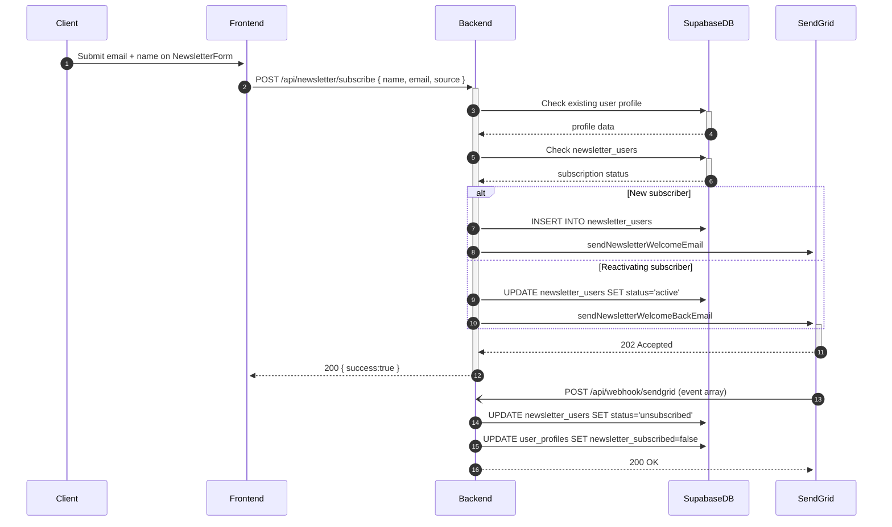

<!-- docs/features/newsletter-and-email.md -->

# Feature Guide – Newsletter & Transactional Email

**Feature owner:** `@communications`  
**Last major update:** 2024-03-19  
**Related tickets:** #55 "Double opt-in", #132 "unsubscribe via DB flag", #170 "bounce handling"

---

## 1. What the feature does

* Captures newsletter sign-ups from the marketing site, *regardless* of user account status.  
* Stores every subscriber in **Supabase** (`newsletter_users`) with source attribution.  
* Sends welcome + confirmation emails through **SendGrid**.  
* Processes **SendGrid Event Webhooks** to keep bounce / spam / unsubscribe status in sync.  
* All other transactional emails (password reset, subscription confirmation, contact form) reuse the same **EmailService** utilities and SendGrid templates.
* Handles newsletter reactivation for previously unsubscribed users.

---

## 2. End-to-end sequence

Diagram source: [`../diagrams/newsletter-flow-seq.mmd`](../diagrams/newsletter-flow-seq.mmd)

---

## 3. Data model highlights

| System | Entity | Key fields | Notes |
| ------ | ------ | ---------- | ----- |
| **Supabase** | `newsletter_users` | `email (PK)`, `name`, `source`, `status: enum('active','unsubscribed','bounced')`, `subscribed_at`, `unsubscribed_at`, `user_id` | Uniqueness on email; upsert path keeps single row |
|  | `user_profiles` | `user_id`, `email`, `newsletter_subscribed` | Linked to newsletter_users via user_id |

Full schema: [`../reference/data-models.md`](../reference/data-models.md)

---

## 4. Key code touch-points

| Layer | File @ line | Purpose |
| ----- | ----------- | ------- |
| **Frontend service** | `frontend/services/newsletterService.ts` | Handles API calls to subscribe endpoint |
| **Backend route** | `backend/src/routes/newsletterRoutes.ts` | Defines subscribe endpoint |
| **Controller** | `backend/src/controllers/newsletterController.ts:1-136` | Handles subscription logic and email sending |
| **Email service** | `backend/src/services/emailService.ts:377-442` | Newsletter welcome and welcome-back emails |
| **Webhook route** | `backend/src/routes/webhookRoutes.ts:1-12` | `/api/webhook/sendgrid` endpoint |
| **Webhook handler** | `backend/src/controllers/webhookController.ts:1-69` | Processes SendGrid events |
| **Webhook verification** | `backend/src/middleware/sendgridWebhookVerification.ts` | Validates SendGrid webhook signatures |

---

## 5. Environment variables

| Name | Example | Used in |
| ---- | ------- | ------- |
| `SENDGRID_API_KEY` | `SG.xxxxxx` | Backend `EmailService` |
| `SENDGRID_WEBHOOK_SIGNING_KEY` | Hex secret | Webhook verification |
| `FROM_EMAIL` | `support@themonetarycatalyst.com` | Sender email for all communications |
| `SENDGRID_IP` | `1.2.3.4` | Email headers for tracking |
| `SENDGRID_CONTACT_FORM_KEY` | `contact-form-123` | Email tracking IDs |
| `NEXT_PUBLIC_API_URL` | `http://localhost:5000` | Frontend API calls |

---

## 6. Error & edge-case behaviour

| Scenario | API response | Frontend handling |
| -------- | ------------ | ----------------- |
| Invalid email syntax | 400 `{ error:"Please provide a valid email address" }` | Inline error message |
| Duplicate sign-up (active) | 400 `{ error:"This email is already subscribed" }` | Show error toast |
| Duplicate sign-up (unsubscribed) | 200 `{ success:true }` | Reactivate + welcome back email |
| SendGrid API failure | 500 `{ error:"Failed to process newsletter subscription" }` | Retry prompt |
| Webhook signature invalid | 401 `{ error:"Invalid webhook signature" }` | Log error, reject event |
| Bounce event | Webhook sets `status='bounced'` | Future sends skip that email |
| Unsubscribe event | Webhook sets `status='unsubscribed'` + updates profile | Compliance with CAN-SPAM |

---

## 7. Open TODOs / Future work

* Implement **double opt-in** flow (confirmation link).  
* Add **monthly digest** cron job using SendGrid Marketing campaigns.  
* Surface "Manage email preferences" in **My Account** once user profiles support it.  
* Add rate limiting for newsletter sign-ups.
* Implement email validation service integration.

---

## 8. Changelog excerpts

* **2024-03-19** – Added newsletter reactivation flow.
* **2024-03-18** – Implemented SendGrid webhook handling.
* **2024-03-17** – Added welcome-back email template.
* **2024-03-16** – Set up newsletter subscription system.
