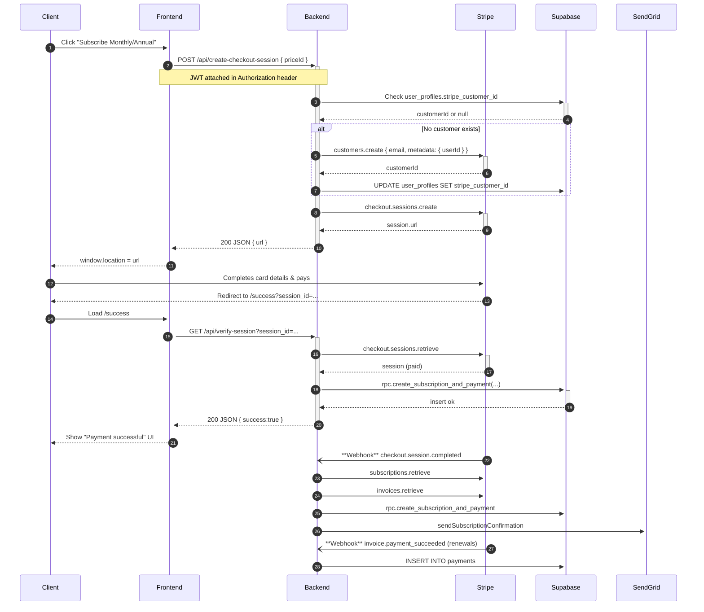

<!-- docs/features/subscriptions-and-payments.md -->

# Feature Guide – Subscriptions & Payments

**Feature owner:** `@payments`  
**Last major update:** 2024-03-19  
**Related tickets:** #42 "setup-intent flow", #88 "cancel at period end UX"

---

## 1. What the feature does

* Sells **monthly** ($35) and **annual** ($336) subscriptions via **Stripe Checkout**.  
* Stores subscription + payment history in **Supabase** (`subscriptions`, `payments`).  
* Uses **webhooks** to stay in sync with Stripe events (renewals, failures, cancels).  
* Frontend gates premium content by checking `subscriptions.status === 'active'`.
* Handles payment method updates and subscription cancellations.
* Sends subscription confirmation emails via SendGrid.

---

## 2. End-to-end sequence

Diagram source: [`diagrams/subscriptions-seq.mmd`](../diagrams/subscriptions-seq.mmd)

---

## 3. Data model highlights

| System | Entity | Key fields | Notes |
| ------ | ------ | ---------- | ----- |
| **Stripe** | `Customer` | `id`, `email`, `metadata.userId` | Linked 1-to-1 with `user_profiles.stripe_customer_id` |
|  | `Subscription` | `status`, `current_period_end`, `cancel_at_period_end` | Mirrors Supabase `subscriptions` row |
|  | `Invoice` & `PaymentIntent` | `amount_paid`, `status`, `payment_intent` | One invoice per renewal; webhook inserts `payments` row |
| **Supabase** | `subscriptions` | `id`, `user_id`, `stripe_subscription_id`, `status`, `plan_type`, `current_period_end`, `cancelled_at` | `status` enum: `active`, `inactive`, `expired`, `past_due` |
|  | `payments` | `id`, `subscription_id`, `amount`, `payment_intent_id`, `invoice_id`, `status` | Historical ledger |
|  | `user_profiles` | `user_id`, `stripe_customer_id` | Links user to Stripe customer |

Full schemas: [`../reference/data-models.md`](../reference/data-models.md)

---

## 4. Key code touch-points

| Layer | File @ line | Purpose |
| ----- | ----------- | ------- |
| **Frontend** | `frontend/app/pricing/page.tsx:1-165` | Handles plan selection and checkout initiation |
|  | `frontend/app/success/page.tsx` | Verifies session, shows success / error |
|  | `frontend/components/PaymentDetails.tsx` | Payment method management UI |
| **Backend routes** | `backend/src/routes/paymentRoutes.ts:1-8` | Defines payment endpoints |
| **Controller** | `backend/src/controllers/paymentController.ts:81-276` | Creates Stripe customer + checkout session |
|  | `paymentController.ts:435-484` | Session verification after redirect |
|  | `paymentController.ts:276-356` | Webhook event processing |
| **Middleware** | `backend/src/middleware/authMiddleware.ts` | Secures all non-webhook payment routes |
| **Supabase RPC** | `database/functions/create_subscription_and_payment.sql` | Atomic subscription + payment creation |
| **Email** | `backend/src/services/emailService.ts` | Sends subscription confirmation |

---

## 5. Environment variables

| Name | Example value | Required by | Notes |
| ---- | ------------- | ----------- | ----- |
| `STRIPE_SECRET_KEY` | `sk_live_...` | Backend | **Never** commit |
| `STRIPE_WEBHOOK_SECRET` | `whsec_...` | Backend webhook | Separate per env |
| `NEXT_PUBLIC_STRIPE_PUBLISHABLE_KEY` | `pk_live_...` | Frontend | Safe to expose |
| `NEXT_PUBLIC_STRIPE_MONTHLY_PRICE_ID` | `price_1234...` | Frontend | Monthly plan |
| `NEXT_PUBLIC_STRIPE_ANNUAL_PRICE_ID` | `price_5678...` | Frontend | Annual plan |
| `NEXT_PUBLIC_API_URL` | `https://api.themonetarycatalyst.com` | Frontend | API endpoint |

---

## 6. Error & edge-case behaviour

| Scenario | API response | Frontend reaction |
| -------- | ------------ | ----------------- |
| Invalid `priceId` | `400 { error:"priceId is required" }` | Toast error |
| No auth token | `401 { error:"Unauthorized" }` | Redirect to login |
| Card declined | User stays on Stripe, sees decline UI | No backend call until Stripe retries |
| Webhook signature mismatch | `400` logged only | Stripe will auto-retry; alert sent to Slack |
| Invoice payment failed | Webhook sets `subscriptions.status = 'past_due'` | Next content request → 403 gate |
| RPC failure | `500 { error:"Failed to create subscription" }` | Show error, allow retry |
| Session verification failed | `400 { error:"Invalid session ID" }` | Show error, redirect to pricing |

---

## 7. Open TODOs / Future work

* Implement **customer portal** link (`billing_portal.sessions.create`) for self-serve card updates.  
* Migrate webhook processing to **background queue** (BullMQ) for resilience.  
* Add **grace period** logic for `past_due` → allow 3-day access window.  
* Add support for multiple payment methods per customer.
* Implement subscription upgrade/downgrade flow.

---

## 8. Changelog excerpts

* **2024-03-19** – Added subscription reactivation flow.
* **2024-03-18** – Implemented Stripe webhook handling.
* **2024-03-17** – Added payment method management.
* **2024-03-16** – Set up subscription system.
