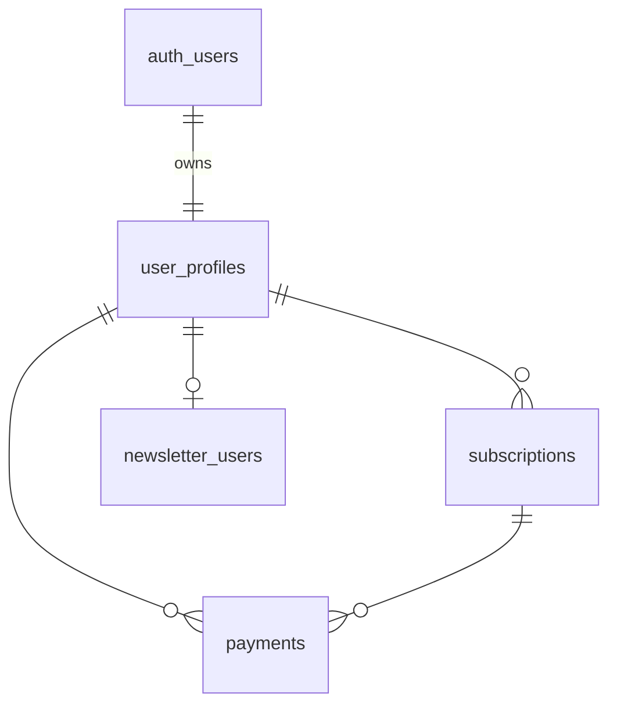

<!-- docs/reference/data-models.md -->

# Reference – Data Models  
*(PostgreSQL @ Supabase + Strapi CMS)*

> **Scope:** Every custom table or collection type the code touches.  
> Generated columns, RLS policies, triggers, and indexes are called out inline.

---

## 1. Supabase – Public Schema

### 1.1 `user_profiles`

| Column                | Type      | Constraints / Notes                                                                 |
|---------------------- |---------- |------------------------------------------------------------------------------------|
| `user_id`             | `uuid`    | **PK**, FK → `auth.users.id`                                                       |
| `created_at`          | `timestamptz` | default `now()`                                                                  |
| `email`               | `text`    | unique partial index `(email) WHERE deleted_at IS NULL`                            |
| `google_id`           | `text`    | nullable (Google OAuth sub)                                                        |
| `updated_at`          | `timestamptz` | trigger `on_update_timestamp`                                                    |
| `role`                | `text`    | default `'user'` (`'user'` \| `'admin'`)                                          |
| `first_name`          | `text`    |                                                                                    |
| `last_name`           | `text`    |                                                                                    |
| `terms_accepted`      | `boolean` | default `false`                                                                    |
| `stripe_customer_id`  | `text`    | null until first checkout                                                          |
| `newsletter_subscribed`| `boolean`| denormalized flag – syncs to `newsletter_users.status='active'`                    |

> **Trigger:** `user_profiles_updated_at` sets `updated_at` on INSERT/UPDATE.  
> **RLS:** Select/edit allowed only for owner (`user_id = auth.uid()`); backend bypasses via service role.

---

### 1.2 `subscriptions`

| Column                 | Type      | Constraints / Notes                                                               |
|----------------------- |---------- |----------------------------------------------------------------------------------|
| `id`                   | `uuid`    | **PK** default `gen_random_uuid()`                                                |
| `created_at`           | `timestamptz` | default `now()`                                                                |
| `user_id`              | `uuid`    | FK → `user_profiles.user_id`                                                      |
| `start_date`           | `date`    |                                                                                   |
| `end_date`             | `date`    | Stripe → `current_period_end`                                                     |
| `last_payment_id`      | `uuid`    | FK → `payments.id` (nullable)                                                     |
| `updated_at`           | `timestamptz` | trigger                                                                         |
| `plan_type`            | `text`    | CHECK (`plan_type in ('monthly','yearly')`)                                      |
| `status`               | `text`    | CHECK (`status in ('active','inactive','expired','past_due')`)                   |
| `subscription_type`    | `text`    | `'professional'` \| `'student'` (student = non-recurring)                        |
| `stripe_subscription_id`| `text`   | unique                                                                            |
| `payment_status`       | `text`    | `'paid'` \| `'unpaid'` \| `'past_due'` (mirrors Stripe)                          |
| `last_payment_date`    | `timestamptz` |                                                                                 |
| `cancelled_at`         | `timestamptz` | set when user cancels                                                           |

> **Composite index:** `(user_id, status)` for fast "is user subscribed?" checks.

---

### 1.3 `payments`

| Column                | Type      | Constraints / Notes                                                               |
|---------------------- |---------- |----------------------------------------------------------------------------------|
| `id`                  | `uuid`    | **PK**                                                                            |
| `created_at`          | `timestamptz` | default `now()`                                                                |
| `user_id`             | `uuid`    | FK → `user_profiles.user_id`                                                      |
| `subscription_id`     | `uuid`    | FK → `subscriptions.id`                                                           |
| `amount`              | `numeric(10,2)` | stored in USD                                                                  |
| `date`                | `timestamptz` | Stripe event time                                                               |
| `updated_at`          | `timestamptz` | trigger                                                                         |
| `status`              | `text`    | `'successful'` \| `'failed'` \| `'refunded'`                                     |
| `stripe_payment_id`   | `text`    | id from PaymentIntent                                                             |
| `stripe_invoice_id`   | `text`    | id from Invoice                                                                   |
| `stripe_payment_status`| `text`   | raw Stripe state                                                                  |

---

### 1.4 `newsletter_users`

| Column                | Type      | Constraints / Notes                                                               |
|---------------------- |---------- |----------------------------------------------------------------------------------|
| `id`                  | `uuid`    | **PK**                                                                            |
| `email`               | `text`    | **unique**; main lookup                                                           |
| `name`                | `text`    | optional                                                                          |
| `status`              | `text`    | CHECK (`status IN ('active','unsubscribed','bounced')`)                           |
| `source`              | `text`    | `'footer'` \| `'signup'` \| `'import'` \| `'api'`                                 |
| `subscribed_at`       | `timestamptz` | default `now()` on insert                                                       |
| `unsubscribed_at`     | `timestamptz` | nullable                                                                        |
| `updated_at`          | `timestamptz` | trigger                                                                         |
| `user_id`             | `uuid`    | FK → `user_profiles.user_id`, nullable                                            |
| `interests`           | `text[]`  | e.g. `{'macro','equities'}`                                                      |
| `country`             | `text`    | ISO-3166                                                                          |
| `timezone`            | `text`    | IANA                                                                              |
| `referral_source`     | `text`    | e.g. `twitter`, `webinar`                                                         |
| `last_email_sent`     | `timestamptz` | updated by newsletter job                                                        |
| `email_frequency`     | `text`    | `'weekly'` \| `'monthly'` (default `'weekly'`)                                    |
| `tags`                | `text[]`  | free-form segmentation                                                            |

> **Trigger:** sets `updated_at`.  
> **RLS:** Reads open; writes require either service role or email owner (for self-unsubscribe link).

---

### 1.5 Utility Tables

| Table                | Purpose                                         |
|----------------------|-------------------------------------------------|
| `contact_messages`   | Archive of contact-form submissions (optional)  |
| `migration_meta`     | Tracked by Supabase CLI for schema migrations  |

*(Utility tables not used directly in code are omitted.)*

---

## 2. Supabase – Functions & Policies

| Function                        | Args → Returns                                                      | Purpose                                                                 |
|----------------------------------|---------------------------------------------------------------------|-------------------------------------------------------------------------|
| `create_subscription_and_payment`| `(p_user_id uuid, p_sub_id text, p_invoice_id text, p_amount numeric)` → `void` | Atomically insert one row in `subscriptions` **and** one row in `payments`. Called from Stripe webhook. |

*(See `database/functions/*.sql` for full bodies.)*

---

## 3. Strapi CMS – Collection Types

### 3.1 `Article`

| Field            | Type         | Notes                                  |
|------------------|--------------|----------------------------------------|
| `id`             | UID          |                                        |
| `title`          | `string`     |                                        |
| `slug`           | `uid`        | unique                                 |
| `content`        | `richtext`   | Markdown blocks allowed                |
| `excerpt`        | `text`       | first paragraph for preview            |
| `article_type`   | enum(`market-analysis`,`investment-idea`) |         |
| `isSample`       | `boolean`    | free sample flag                       |
| `feature_image`  | media        | hero image                             |
| `article_images` | media[]      | inline gallery                         |
| `author`         | relation → `Author` |                                 |
| `publish_date`   | `date`       |                                        |
| Timestamps       | auto         | `createdAt`,`updatedAt`                |

### 3.2 `Author` (single)

| Field    | Type    |
|----------|---------|
| `name`   | string  |
| `avatar` | media   |
| `bio`    | richtext|

*(Strapi single types for About/Legal pages are documented in `cms/README.md`.)*

---

## 4. ER Diagram – Supabase

---

### Notes & Guarantees

* **All money columns** stored in **USD cents** within Stripe; we cast to `numeric(10,2)` in database for human-readability.  
* **Stripe IDs** are stored verbatim (`stripe_*`) for reconciliation.  
* **Updated_at triggers** created via `CREATE TRIGGER … EXECUTE PROCEDURE trigger_set_updated_at();`.  
* RLS policies mirror the backend's intentions but are bypassed by the service-role key when the API executes server-side logic.

### Enums

- `plan_type_enum`: `'monthly'`, `'yearly'`
- `subscription_status_enum`: `'active'`, `'inactive'`, `'expired'`, `'past_due'`
- `subscription_type_enum`: `'professional'`, `'student'`
- `payment_status_enum`: `'successful'`, `'failed'`, `'refunded'`
- `article_type_enum`: `'market-analysis'`, `'investment-idea'`

*Updated: 2024-03-19 – synced with live Supabase and Strapi schema.*
